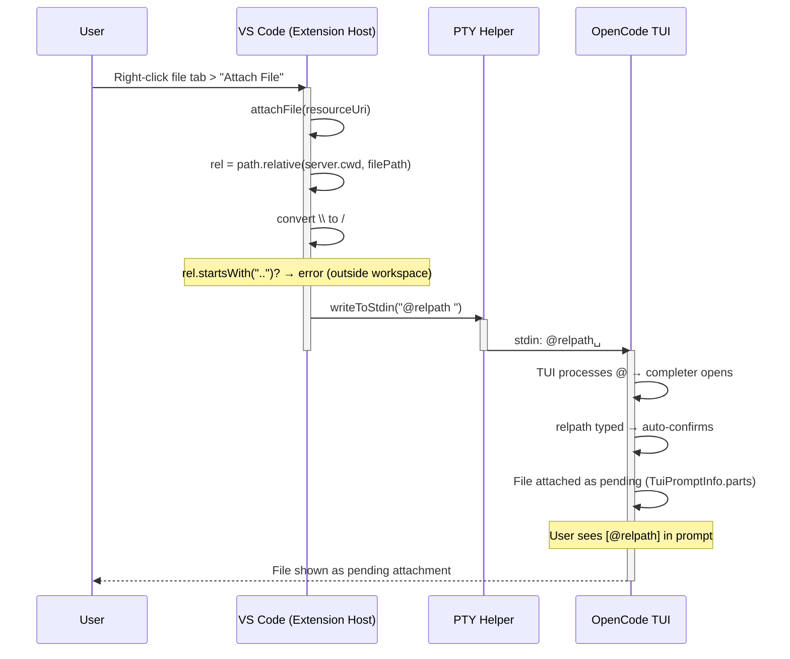

# File Attachment Flow

```mermaid
sequenceDiagram
    participant User
    participant VSCode as VS Code (Extension Host)
    participant PTY as PTY Helper
    participant OC as OpenCode TUI

    User->>VSCode: Right-click file tab > "Attach File"
    activate VSCode
    
    VSCode->>VSCode: attachFile(resourceUri)
    VSCode->>VSCode: rel = path.relative(server.cwd, filePath)
    VSCode->>VSCode: convert \\ to /
    
    Note over VSCode: rel.startsWith("..")? → error (outside workspace)
    
    VSCode->>PTY: writeToStdin("@relpath ")
    activate PTY
    PTY->>OC: stdin: @relpath␣
    deactivate PTY
    deactivate VSCode
    
    activate OC
    OC->>OC: TUI processes @ → completer opens
    OC->>OC: relpath typed → auto-confirms
    OC->>OC: File attached as pending (TuiPromptInfo.parts)
    Note over OC: User sees [@relpath] in prompt
    
    OC-->>User: File shown as pending attachment
    deactivate OC
```

TASK_STATUS: COMPLETE
