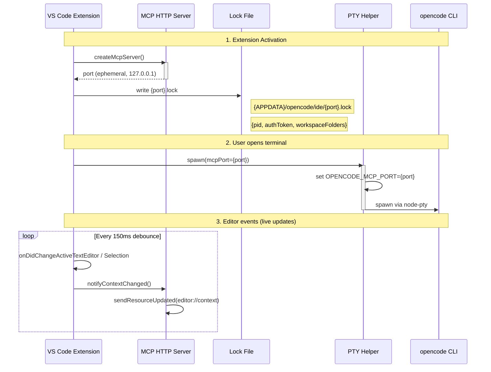

# IDE Context Awareness (MCP) Flow

## Sequence Diagram



## Component Overview

```
Extension Host (VS Code)
├── mcp-server.ts          MCP HTTP server (127.0.0.1:port)
│   ├── POST /             MCP initialize + request handling
│   ├── GET /              SSE notification stream
│   └── DELETE /           Session cleanup
│
├── vscode-editor-state.ts Reads activeTextEditor → EditorContext
│   └── editor://context   Resource: {uri, selection?}
│
├── extension.ts           Lifecycle: start/stop, lock file,
│                          debounced listeners, env passthrough
│
├── opencodeServer.ts      setMcpPort() → spawn msg → PTY
└── ptyHelper.ts           Env: OPENCODE_MCP_PORT → node-pty
```

## Lock File Protocol

Location: `{xdgData}/opencode/ide/{port}.lock`
Content: `{pid: number, workspaceFolders: string[], authToken: string}`
Discovery: opencode reads `OPENCODE_MCP_PORT` env → lock file → PID verify → Bearer auth → MCP connect

## System Prompt Injection

On the CLI side (`packages/opencode/src/session/system.ts`):

```xml
<ide-context>
  The user has file:///path/to/file.ts open in their IDE.
  They have lines 10-25 selected:
  selected text content
</ide-context>
```

This is part of the system prompt (gray line in TUI). Agent sees it automatically.
