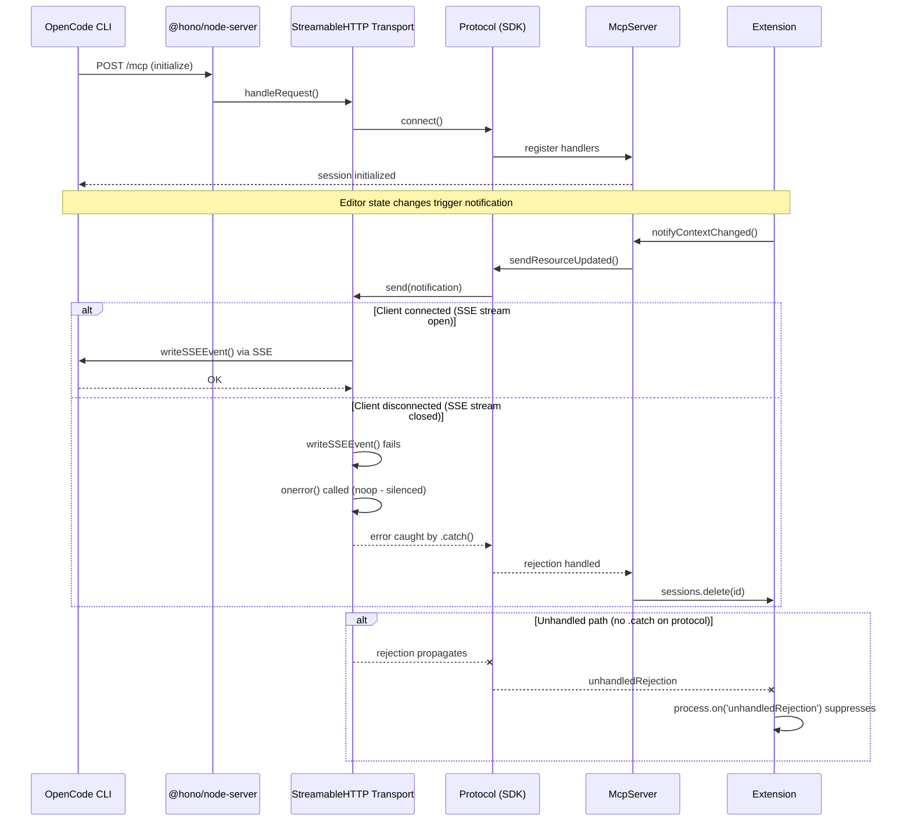
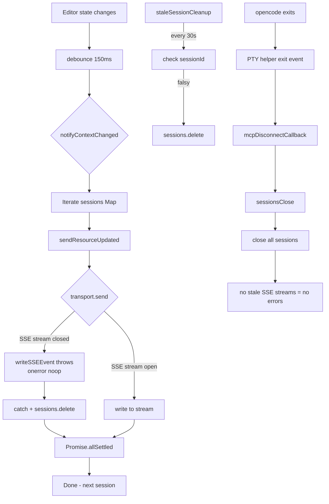

# MCP Server Error Handling Flow

## Changes Made

### `src/extension.ts`
- Added `serverManager.onMcpClientDisconnect()` — when opencode stops, closes all MCP sessions immediately, preventing stale SSE streams

### `src/opencodeServer.ts`
- Added `onMcpClientDisconnect()` method and callback — triggered when PTY helper exits, opencode stops, or PTY errors occur
- The callback fires in three places: exit, stop, and PTY error

### `src/mcp-server.ts`
- Added `transport.onerror = () => {}` — silences SSE stream write errors in the transport layer
- Wrapped HTTP request handler in try/catch — prevents unhandled async rejections from `http.createServer`
- Added periodic stale session cleanup (30s interval) — removes sessions whose `sessionId` is falsy (disconnected)
- Added `sessionsClose()` method to `McpServerHandle` — closes all active sessions without stopping the HTTP server, allowing clean reconnection
