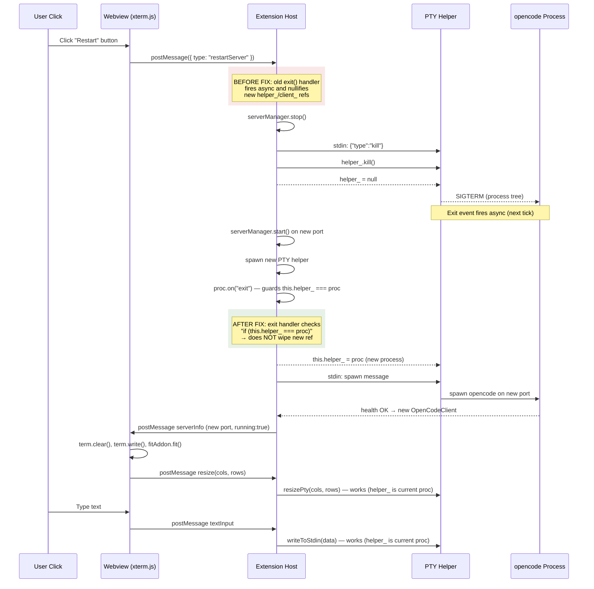
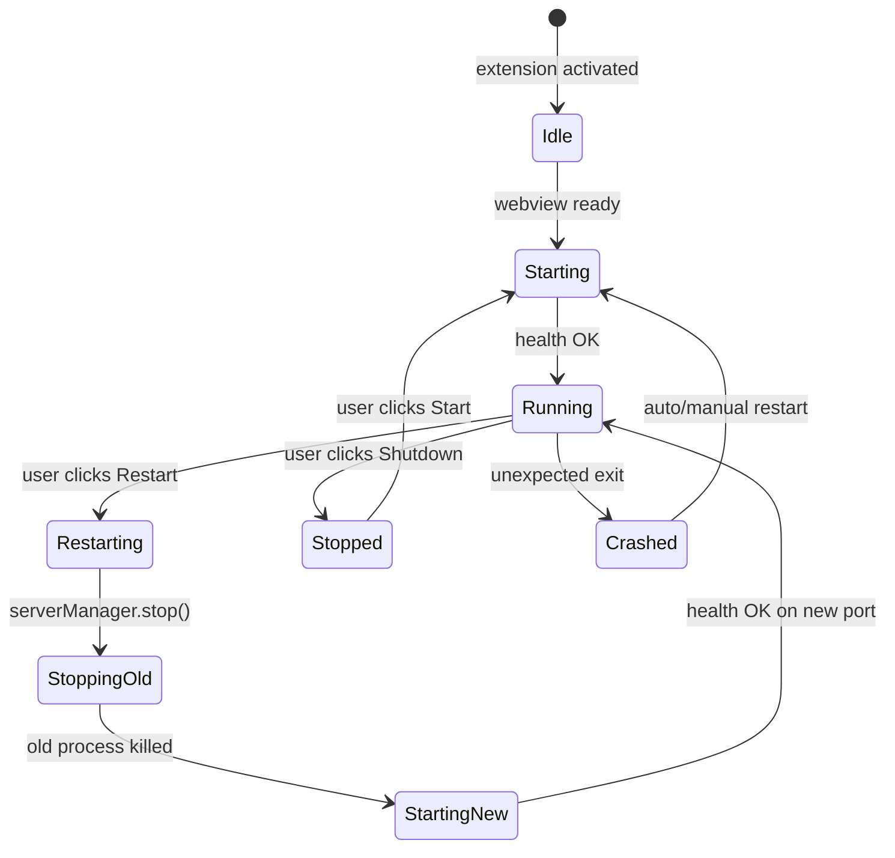
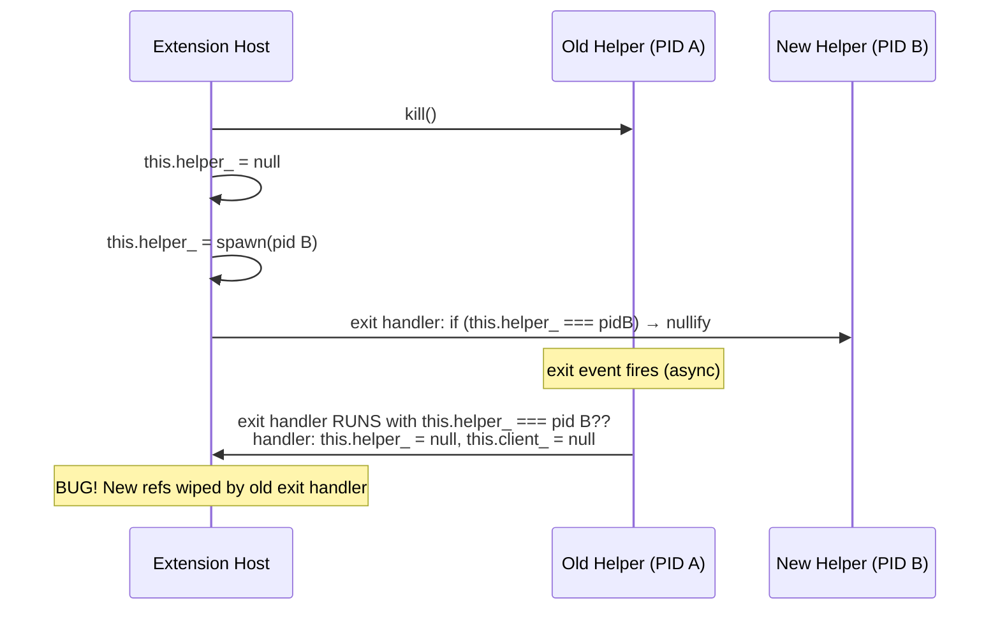

# Server Restart Flow

## Sequence Diagram

## State Diagram

## Race Condition (Before Fix)

After the fix, the old exit handler checks `this.helper_ === proc` (captured local ref), so it only nullifies if the current helper is still the same process that exited.
