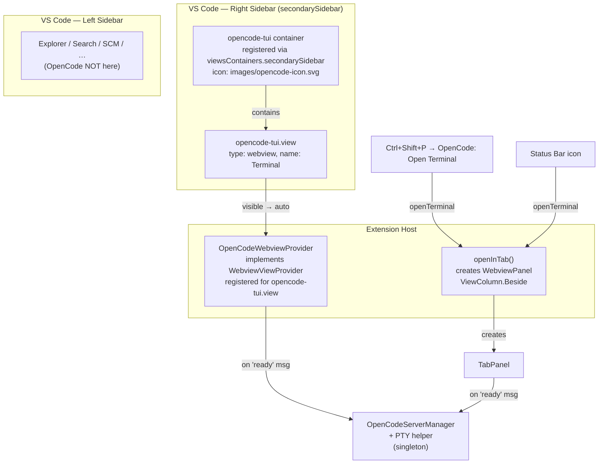
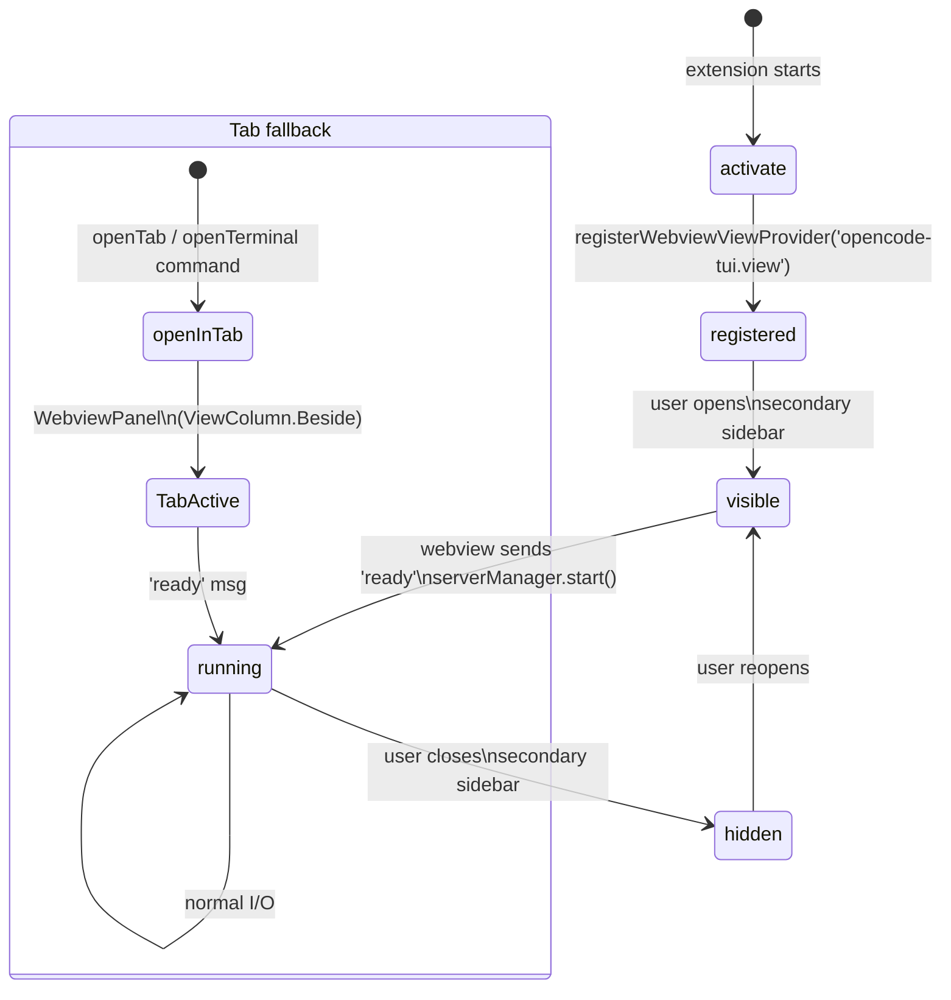

# Sidebar / Tab Architecture

## View Location



## package.json contributions

```json
"viewsContainers": {
  "secondarySidebar": [
    {
      "id": "opencode-tui",
      "title": "OpenCode",
      "icon": "images/opencode-icon.svg"
    }
  ]
},
"views": {
  "opencode-tui": [
    {
      "type": "webview",
      "id": "opencode-tui.view",
      "name": "Terminal"
    }
  ]
}
```

Key points:
- `secondarySidebar` (lowercase `b`) — the correct key per VS Code source (`src/vs/workbench/api/browser/viewsExtensionPoint.ts`)
- PR [#261619](https://github.com/microsoft/vscode/pull/261619) merged August 25, 2025 — stable API since VS Code ~1.96
- No `enabledApiProposals` needed — API is final
- No `activitybar` entry — container lives only in the right sidebar

## Provider lifecycle



## Key design

- `viewsContainers.secondarySidebar` — container registered directly in the right sidebar (stable API since VS Code 1.96)
- `WebviewViewProvider` registered with view id `opencode-tui.view`
- Both sidebar view and tab panel share same `serverManager` singleton
- `openTerminal`/`openTab` → `openInTab()` as tab fallback for users who want Beside-column view
- `retainContextWhenHidden: true` on sidebar keeps terminal alive when collapsed
