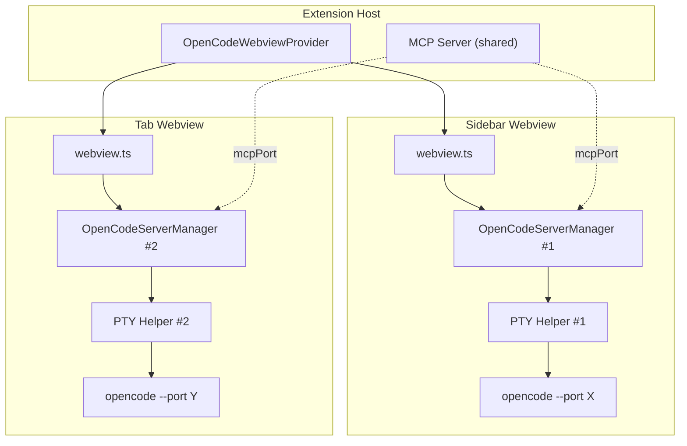
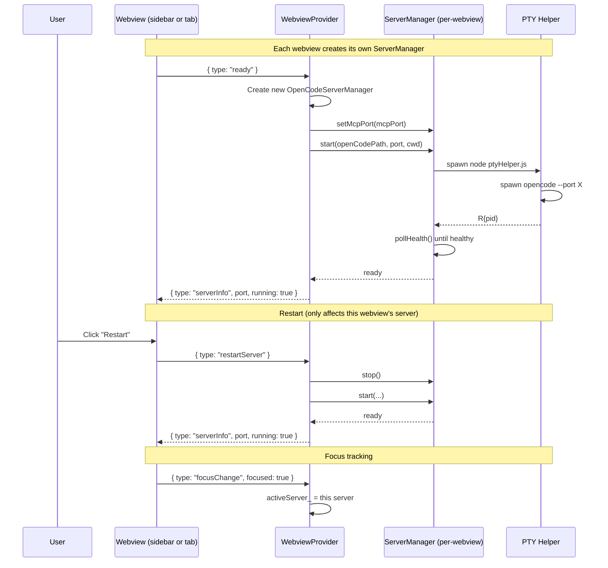
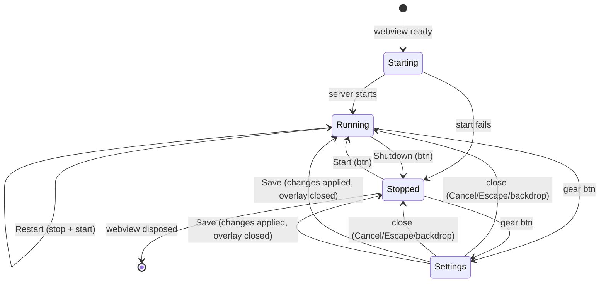

# Status Bar and Server Architecture Flow

## Architecture Overview



## Server Lifecycle per Webview



## State Diagram (per webview)



## Settings Modal Layout

```
+----------------------------------+
| Settings                         |
|                                  |
| OpenCode Path                    |
| [  ____________________________]|
|                                  |
| Server Port (0 = auto)           |
| [  ____________________________]|
|                                  |
| Leader Chords (comma separated)  |
| [  ____________________________]|
|                                  |
| [x] Ctrl+A Select All (fix)      |
|                                  |
|              [Cancel]  [Save]    |
+----------------------------------+
```
