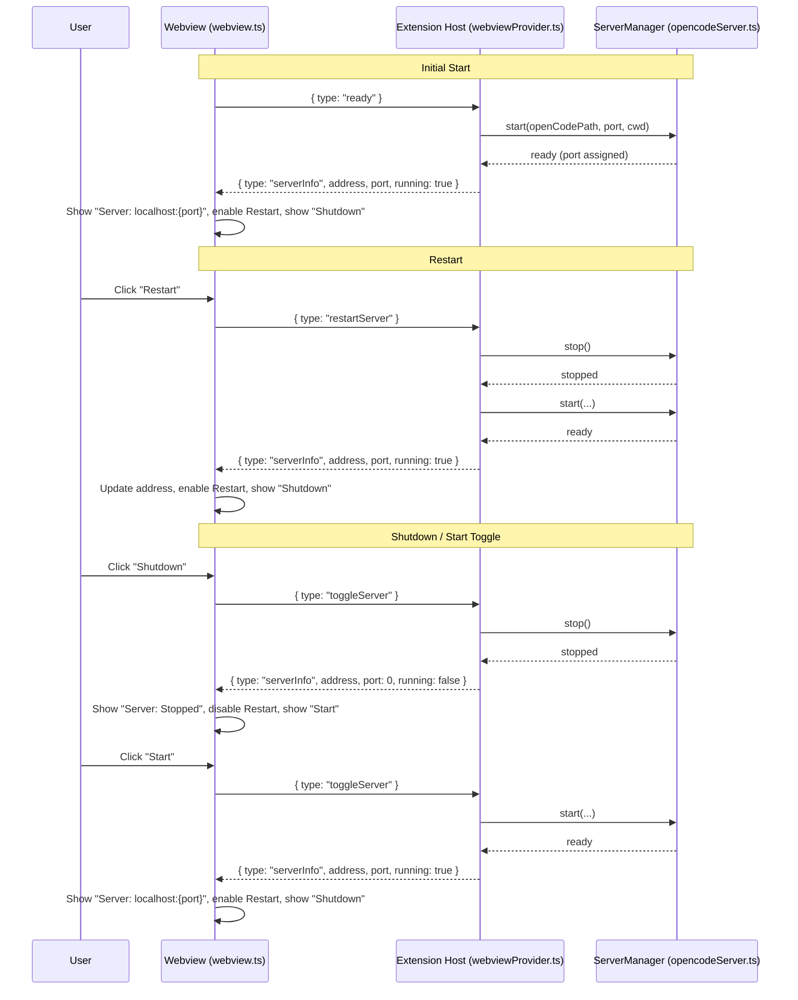
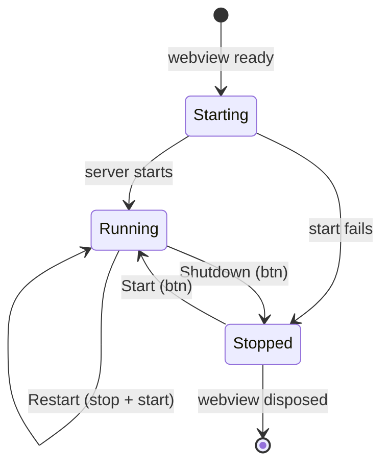

# Status Bar Interaction Flow

## Sequence Diagram

```mermaid
sequenceDiagram
    participant User
    participant Webview as Webview (webview.ts)
    participant Ext as Extension Host (webviewProvider.ts)
    participant SM as ServerManager (opencodeServer.ts)

    Note over Webview,SM: Initial Start
    Webview->>Ext: { type: "ready" }
    Ext->>SM: start(openCodePath, port, cwd)
    SM-->>Ext: ready (port assigned)
    Ext-->>Webview: { type: "serverInfo", address, port, running: true }
    Webview->>Webview: Show "Server: localhost:{port}", enable Restart, show "Shutdown"

    Note over Webview,SM: Restart
    User->>Webview: Click "Restart"
    Webview->>Ext: { type: "restartServer" }
    Ext->>SM: stop()
    SM-->>Ext: stopped
    Ext->>SM: start(...)
    SM-->>Ext: ready
    Ext-->>Webview: { type: "serverInfo", address, port, running: true }
    Webview->>Webview: Update address, enable Restart, show "Shutdown"

    Note over Webview,SM: Shutdown / Start Toggle
    User->>Webview: Click "Shutdown"
    Webview->>Ext: { type: "toggleServer" }
    Ext->>SM: stop()
    SM-->>Ext: stopped
    Ext-->>Webview: { type: "serverInfo", address, port: 0, running: false }
    Webview->>Webview: Show "Server: Stopped", disable Restart, show "Start"

    User->>Webview: Click "Start"
    Webview->>Ext: { type: "toggleServer" }
    Ext->>SM: start(...)
    SM-->>Ext: ready
    Ext-->>Webview: { type: "serverInfo", address, port, running: true }
    Webview->>Webview: Show "Server: localhost:{port}", enable Restart, show "Shutdown"
```

## State Diagram

```mermaid
stateDiagram-v2
    [*] --> Starting: webview ready
    Starting --> Running: server starts
    Starting --> Stopped: start fails

    Running --> Running: Restart (stop + start)
    Running --> Stopped: Shutdown (btn)

    Stopped --> Running: Start (btn)
    Stopped --> [*]: webview disposed
```
